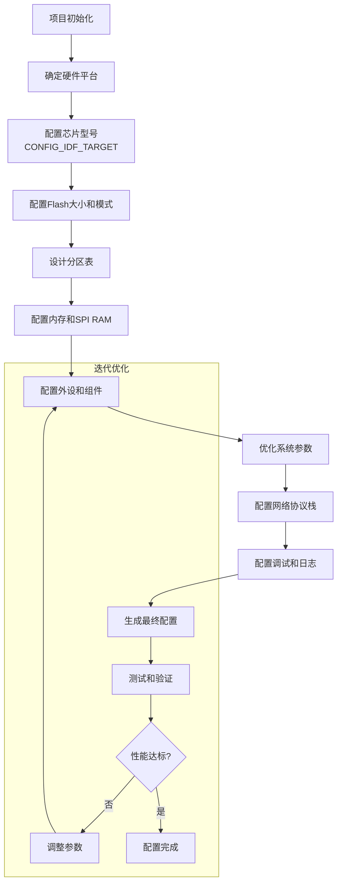

# ESP32参数配置指南 - 基于小智智能语音设备项目

## 概述

ESP-IDF（Espressif IoT Development Framework）提供了丰富的配置选项来定制ESP32系列芯片的行为。本文档基于小智智能语音设备项目的实际配置经验，总结了ESP32参数配置的流程、各参数的意义以及最佳实践。

## 配置流程

### 标准配置流程



### 配置工具与方法

1. **菜单配置**：使用 `idf.py menuconfig` 交互式配置
2. **默认配置**：创建 `sdkconfig.defaults` 文件设置默认值
3. **分区表**：编辑 `partitions.csv` 定义存储布局
4. **组件配置**：通过 `Kconfig.projbuild` 添加组件特定配置

## 参数分类与详细说明

### 1. 芯片与目标配置

| 参数 | 默认值 | 说明 | 配置建议 |
|------|--------|------|----------|
| `CONFIG_IDF_TARGET` | "esp32" | 目标芯片型号 | 根据实际硬件选择：`esp32`, `esp32s2`, `esp32s3`, `esp32c3` |
| `CONFIG_ESP_DEFAULT_CPU_FREQ_MHZ` | 240 | CPU默认频率 | 平衡性能和功耗：80/160/240MHz |

**示例配置**：
```bash
# 小智项目配置
CONFIG_IDF_TARGET="esp32s3"
CONFIG_ESP_DEFAULT_CPU_FREQ_MHZ_240=y
```

### 2. Flash存储配置

| 参数 | 默认值 | 说明 | 配置建议 |
|------|--------|------|----------|
| `CONFIG_ESPTOOLPY_FLASHSIZE` | "4MB" | Flash大小 | 根据硬件实际大小：2MB/4MB/8MB/16MB |
| `CONFIG_ESPTOOLPY_FLASHMODE` | "qio" | Flash访问模式 | QIO（四线）性能最好，DIO（双线）兼容性好 |
| `CONFIG_PARTITION_TABLE_CUSTOM` | n | 使用自定义分区表 | 复杂项目建议启用，简单项目可使用默认分区表 |

**示例配置**：
```bash
CONFIG_ESPTOOLPY_FLASHMODE_QIO=y
CONFIG_ESPTOOLPY_FLASHSIZE_8MB=y
CONFIG_PARTITION_TABLE_CUSTOM=y
```

### 3. 分区表配置

分区表定义了Flash存储的布局，通过 `partitions.csv` 文件配置：

```csv
# ESP-IDF Partition Table
# Name,   Type, SubType, Offset,  Size, Flags
nvs,      data, nvs,     0x9000,  0x4000,
otadata,  data, ota,     0xd000,  0x2000,
phy_init, data, phy,     0xf000,  0x1000,
ota_0,    app,  ota_0,   0x10000, 0x3C0000,
ota_1,    app,  ota_1,          , 0x3C0000,
model,    data, nvs,            , 0x67000
```

**分区类型说明**：
- **nvs**：非易失性存储，用于存储配置数据和键值对
- **otadata**：OTA数据分区，记录当前运行的固件版本
- **phy_init**：PHY初始化数据，Wi-Fi/BT射频参数
- **app**：应用程序分区，可配置多个实现OTA
- **data**：自定义数据分区，如模型文件、配置文件

### 4. 内存配置（SPI RAM）

| 参数 | 默认值 | 说明 | 配置建议 |
|------|--------|------|----------|
| `CONFIG_SPIRAM` | n | 启用SPI RAM | 需要大内存时启用，ESP32-S3支持8MB PSRAM |
| `CONFIG_SPIRAM_SPEED` | 80M | SPI RAM时钟速度 | 与硬件匹配，通常80MHz |
| `CONFIG_SPIRAM_TRY_ALLOCATE_WIFI_LWIP` | y | WiFi/LWIP使用SPI RAM | 减少内部RAM压力时启用 |
| `CONFIG_SPIRAM_ALLOW_BSS_SEG_EXTERNAL_MEMORY` | y | BSS段放外部内存 | 减少内部RAM使用 |
| `CONFIG_SPIRAM_ALLOW_NOINIT_SEG_EXTERNAL_MEMORY` | y | NOINIT段放外部内存 | 减少内部RAM使用 |

**内存分配策略**：
- **内部RAM**（512KB）：任务栈、ISR、高频访问小对象
- **SPI RAM**（8MB）：音频缓冲区、帧缓冲区、网络缓冲区
- **Flash**（8MB）：代码、只读数据、配置文件

### 5. Wi-Fi网络配置

| 参数 | 默认值 | 说明 | 配置建议 |
|------|--------|------|----------|
| `CONFIG_ESP_WIFI_STATIC_RX_BUFFER_NUM` | 10 | 静态RX缓冲区数量 | 根据并发连接数调整，默认10个 |
| `CONFIG_ESP_WIFI_RX_BA_WIN` | 6 | TCP接收窗口大小 | 影响网络吞吐量，默认6个包 |
| `CONFIG_ESP_WIFI_TX_BUFFER` | dynamic | TX缓冲区分配 | 静态分配提高稳定性，动态分配节省内存 |

**Wi-Fi性能优化**：
```bash
# 小智项目配置
CONFIG_ESP_WIFI_STATIC_RX_BUFFER_NUM=10
CONFIG_ESP_WIFI_RX_BA_WIN=6
CONFIG_ESP_WIFI_SOFTAP_BEACON_MAX_LEN=752
```

### 6. 蓝牙配置

| 参数 | 默认值 | 说明 | 配置建议 |
|------|--------|------|----------|
| `CONFIG_BT_ENABLED` | n | 启用蓝牙 | 需要蓝牙功能时启用 |
| `CONFIG_BT_NIMBLE_ENABLED` | n | 使用NimBLE协议栈 | 蓝牙低功耗应用建议启用 |

### 7. 音频与语音识别配置

| 参数 | 默认值 | 说明 | 配置建议 |
|------|--------|------|----------|
| `CONFIG_SR_WN_WN9S_NIHAOXIAOZHI` | n | 中文唤醒词"你好小智" | 语音唤醒设备时启用 |
| `CONFIG_SR_VADN_VADNET1_MEDIUM` | n | 语音活动检测中等模型 | 语音交互应用启用 |
| `CONFIG_CODEC_ES7210_SUPPORT` | n | ES7210麦克风支持 | 根据实际硬件编解码器启用 |
| `CONFIG_CODEC_ES8388_SUPPORT` | n | ES8388音频编解码器支持 | 根据实际硬件编解码器启用 |

**音频参数配置**：
```c
// bsp_config.h 中的硬件参数
#define BSP_CODEC_SAMPLE_RATE 16000      // 16kHz采样率
#define BSP_CODEC_BITS_PER_SAMPLE 16     // 16位深度
#define BSP_CODEC_CHANNELS 1             // 单声道
```

### 8. 显示与UI配置（LVGL）

| 参数 | 默认值 | 说明 | 配置建议 |
|------|--------|------|----------|
| `CONFIG_LV_USE_CLIB_MALLOC` | n | 使用系统malloc | 启用以使用SPI RAM分配 |
| `CONFIG_LV_USE_CLIB_STRING` | y | 使用C库字符串函数 | 通常启用 |
| `CONFIG_LV_OS_FREERTOS` | y | FreeRTOS支持 | 使用FreeRTOS时启用 |
| `CONFIG_LV_USE_QRCODE` | n | 二维码显示支持 | 需要显示二维码时启用 |
| `CONFIG_LV_USE_SYSMON` | n | 系统监控显示 | 调试时启用 |

**LVGL字体配置**：
```bash
CONFIG_LV_FONT_MONTSERRAT_20=y      # 20像素字体
CONFIG_LV_FONT_MONTSERRAT_48=y      # 48像素字体
CONFIG_LV_USE_FONT_COMPRESSED=y     # 压缩字体节省空间
```

### 9. FreeRTOS配置

| 参数 | 默认值 | 说明 | 配置建议 |
|------|--------|------|----------|
| `CONFIG_FREERTOS_HZ` | 100 | Tick频率(Hz) | 影响任务调度精度，通常100-1000Hz |
| `CONFIG_FREERTOS_UNICORE` | n | 单核模式 | 双核ESP32建议禁用以利用双核 |
| `CONFIG_FREERTOS_ASSERT_ON_UNTESTED_FUNCTION` | y | 未测试函数断言 | 开发阶段启用，生产环境禁用 |

**任务栈配置经验**：
- 音频处理任务：3-4KB（SPI RAM）
- 网络任务：2-3KB（内部RAM）
- UI任务：2-3KB（内部RAM）
- 主任务：3-4KB（内部RAM）

### 10. 网络协议栈配置（LWIP）

| 参数 | 默认值 | 说明 | 配置建议 |
|------|--------|------|----------|
| `CONFIG_LWIP_TCP_OOSEQ_MAX_PBUFS` | 4 | TCP乱序包最大缓冲数 | 网络不稳定时增加 |
| `CONFIG_LWIP_TCP_WND` | 5744 | TCP窗口大小 | 影响传输效率，默认5744字节 |
| `CONFIG_LWIP_TCP_SND_BUF` | 5744 | TCP发送缓冲区 | 与窗口大小匹配 |

### 11. 安全与TLS配置

| 参数 | 默认值 | 说明 | 配置建议 |
|------|--------|------|----------|
| `CONFIG_MBEDTLS_EXTERNAL_MEM_ALLOC` | n | TLS使用外部内存 | 启用以将TLS缓冲区放在SPI RAM |
| `CONFIG_MBEDTLS_SSL_MAX_CONTENT_LEN` | 16384 | 最大TLS消息长度 | 根据实际需求调整 |

### 12. 日志与调试配置

| 参数 | 默认值 | 说明 | 配置建议 |
|------|--------|------|----------|
| `CONFIG_LOG_MAXIMUM_LEVEL` | Info | 最大日志级别 | 开发用Debug，生产用Error |
| `CONFIG_LOG_DEFAULT_LEVEL` | Info | 默认日志级别 | 根据需求调整 |
| `CONFIG_ESP_CONSOLE_UART_BAUDRATE` | 115200 | 串口波特率 | 通常115200或921600 |

**日志级别说明**：
- **Error** (1)：严重错误，系统无法正常工作
- **Warn** (2)：警告，可能的问题但不影响主要功能
- **Info** (3)：一般信息，重要状态变化
- **Debug** (4)：调试信息，详细信息
- **Verbose** (5)：最详细的信息，可能影响性能

### 13. 组件依赖配置

通过 `idf_component_register` 和 `dependencies.lock` 管理：

```cmake
# CMakeLists.txt 示例
idf_component_register(SRCS "main.c"
                       INCLUDE_DIRS "."
                       REQUIRES esp_websocket_client lvgl)
```

**常用组件**：
- `esp_websocket_client`：WebSocket客户端
- `lvgl`：轻量级图形库
- `esp-sr`：语音识别库
- `esp_codec_dev`：音频编解码器驱动
- `esp_lvgl_port`：LVGL硬件适配层

## 配置最佳实践

### 1. 分层配置策略

```
├── 基础层（必须配置）
│   ├── 芯片型号
│   ├── Flash配置
│   └── 分区表
├── 硬件层（外设配置）
│   ├── 内存布局
│   ├── 外设驱动
│   └── 引脚分配
├── 系统层（操作系统）
│   ├── FreeRTOS参数
│   ├── 网络协议栈
│   └── 安全配置
└── 应用层（业务相关）
    ├── 音频处理
    ├── 显示配置
    └── 网络协议
```

### 2. 内存优化配置

1. **分析内存需求**：计算各模块缓冲区大小
2. **分层分配**：实时数据放内部RAM，大缓冲区放SPI RAM
3. **监控调整**：使用 `heap_caps_print_info()` 监控内存使用
4. **动态调整**：根据运行状态调整缓冲区大小

### 3. 性能优化配置

1. **CPU频率**：按需调整，平衡性能和功耗
2. **Wi-Fi参数**：根据网络环境优化缓冲区
3. **任务优先级**：合理规划任务优先级避免优先级反转
4. **中断配置**：优化中断处理，减少ISR执行时间

### 4. 功耗优化配置

1. **动态频率调整**：空闲时降低CPU频率
2. **Wi-Fi节能模式**：使用 `WIFI_PS_MIN_MODEM` 模式
3. **外设电源管理**：不使用时关闭外设电源
4. **休眠策略**：合理使用深度睡眠模式

## 常见问题与解决方案

### 问题1：内存不足
**表现**：分配失败、系统崩溃
**解决方案**：
1. 启用SPI RAM：`CONFIG_SPIRAM=y`
2. 将大缓冲区移到SPI RAM：`MALLOC_CAP_SPIRAM`
3. 优化缓冲区大小，减少浪费

### 问题2：Wi-Fi连接不稳定
**表现**：频繁断开、速度慢
**解决方案**：
1. 增加RX缓冲区：`CONFIG_ESP_WIFI_STATIC_RX_BUFFER_NUM=16`
2. 优化TCP窗口：`CONFIG_LWIP_TCP_WND=8760`
3. 调整Wi-Fi功率：`CONFIG_ESP_WIFI_TX_POWER=20`

### 问题3：音频质量差
**表现**：杂音、断断续续
**解决方案**：
1. 确保采样率配置正确：`BSP_CODEC_SAMPLE_RATE=16000`
2. 增加音频缓冲区大小
3. 优化任务优先级，确保音频任务及时调度

### 问题4：系统响应慢
**表现**：UI卡顿、语音响应延迟
**解决方案**：
1. 提高CPU频率：`CONFIG_ESP_DEFAULT_CPU_FREQ_MHZ_240=y`
2. 优化任务优先级
3. 减少不必要的日志输出

## 配置验证流程

### 1. 基础功能验证
```bash
# 编译和烧录
idf.py build
idf.py flash monitor

# 检查启动日志
I (0) cpu_start: Starting scheduler on APP CPU.
I (301) spiram: SPI RAM mode: quad-out
I (302) spiram: SPI RAM size: 8MB
```

### 2. 内存使用验证
```c
// 添加内存监控代码
heap_caps_print_info(MALLOC_CAP_INTERNAL);
heap_caps_print_info(MALLOC_CAP_SPIRAM);

// 检查任务栈使用
UBaseType_t free_stack = uxTaskGetStackHighWaterMark(NULL);
ESP_LOGI("MEM", "Free stack: %u", free_stack);
```

### 3. 性能测试
1. **启动时间**：从复位到主任务运行的时间
2. **Wi-Fi连接时间**：从开始连接到获取IP的时间
3. **音频延迟**：从输入到输出的延迟
4. **UI响应时间**：触摸或按钮到界面更新的延迟

## 总结

ESP32参数配置是一个系统工程，需要根据具体应用需求平衡性能、功耗和稳定性。小智智能语音设备项目的配置经验表明：

1. **提前规划**：在项目初期明确配置需求，避免后期重构
2. **分层配置**：按基础层、硬件层、系统层、应用层逐步配置
3. **持续优化**：通过测试和监控不断调整配置参数
4. **文档记录**：详细记录配置决策和变更原因

通过合理的配置，ESP32可以在资源受限的环境下实现复杂的智能语音交互功能，为嵌入式AIoT设备开发提供可靠的基础。

---

**文档版本**：1.0
**创建日期**：2026-03-09
**基于项目**：小智智能语音设备 (xiaozhi-250818)
**适用场景**：ESP32系列芯片的嵌入式项目配置

**相关文档**：
- [嵌入式项目开发经验总结.md](嵌入式项目开发经验总结.md)
- [技术难点与解决方案总结.md](技术难点与解决方案总结.md)
- [项目架构与业务逻辑分析.md](项目架构与业务逻辑分析.md)

**更新记录**：
- v1.0 (2026-03-09)：初始版本，基于小智项目配置经验总结