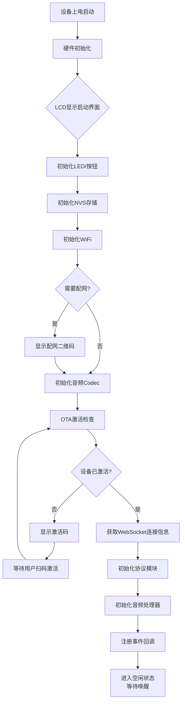
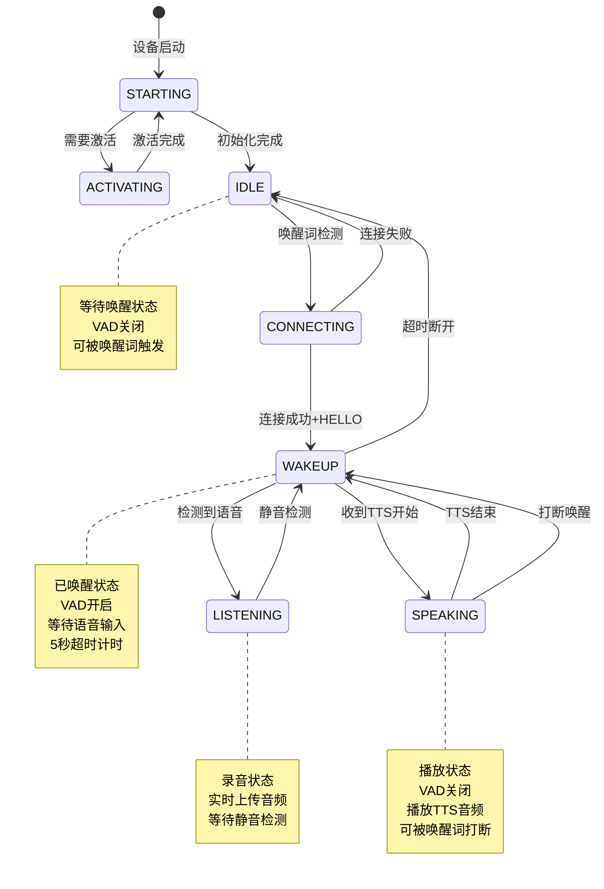
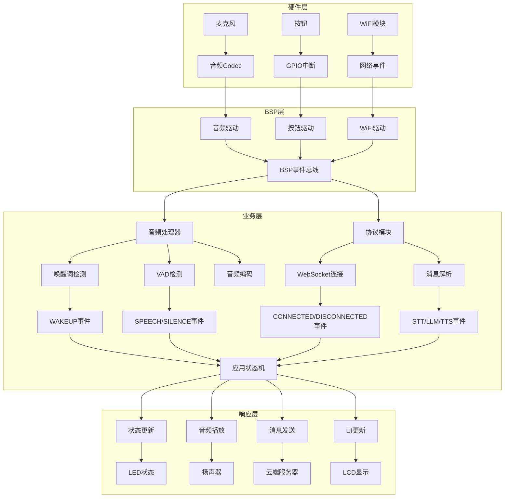
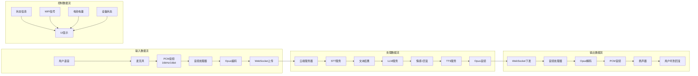
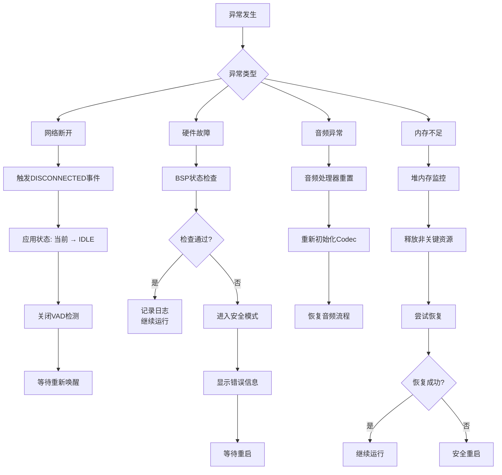
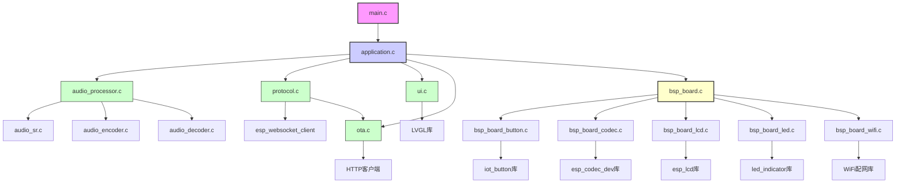

# 小智智能语音设备业务逻辑流程图

## 1. 设备启动与激活流程



## 2. 语音交互完整流程

```mermaid
flowchart TD
    A[空闲状态<br/>APP_STATE_IDLE] --> B{检测到唤醒词<br/>"你好小智"}
    B --> C[连接中状态<br/>APP_STATE_CONNECTING]
    C --> D[建立WebSocket连接]
    D --> E{连接成功?}
    E -->|是| F[发送HELLO消息]
    F --> G[唤醒状态<br/>APP_STATE_WAKEUP]
    E -->|否| A
    G --> H{检测到语音?}
    H -->|是| I[监听状态<br/>APP_STATE_LISTENING]
    I --> J[开始录音并上传]
    J --> K{检测到静音?}
    K -->|是| L[停止录音]
    L --> G
    H -->|否| M{超时5秒?}
    M -->|是| N[断开连接]
    N --> A
    M -->|否| G

    subgraph 服务器处理
        J --> O[云端STT服务]
        O --> P[文本识别结果]
        P --> Q[LLM情感分析]
        Q --> R[生成回复]
        R --> S[TTS语音合成]
    end

    S --> T[收到TTS开始事件]
    T --> U[讲话状态<br/>APP_STATE_SPEAKING]
    U --> V[播放TTS音频]
    V --> W{音频播放完成?}
    W -->|是| X[收到TTS结束事件]
    X --> G
    W -->|否| Y{检测到打断唤醒?}
    Y -->|是| Z[中止播放<br/>重新唤醒]
    Z --> G
    Y -->|否| V
```

## 3. 状态机详细转移图



## 4. 事件驱动架构图



## 5. 数据流示意图



## 6. 异常处理流程图



## 7. 模块依赖关系图



## 关键时序说明

### 典型交互时序
1. **唤醒阶段**：<200ms响应时间
2. **连接阶段**：1-3秒网络连接时间
3. **录音阶段**：用户说话时长 + 静音检测
4. **处理阶段**：云端处理时间（STT+LLM+TTS）
5. **播放阶段**：TTS音频播放时间

### 超时控制
- **唤醒超时**：5秒无语音输入 → 断开连接
- **网络超时**：连接建立超时 → 重试机制
- **录音超时**：最长录音时间限制

### 实时性要求
- **音频采集**：实时无延迟
- **唤醒检测**：<200ms延迟
- **VAD检测**：实时检测
- **UI更新**：<100ms响应

这些流程图清晰地展示了小智智能语音设备的完整业务逻辑，从设备启动到语音交互的各个环节，以及异常处理和模块关系。