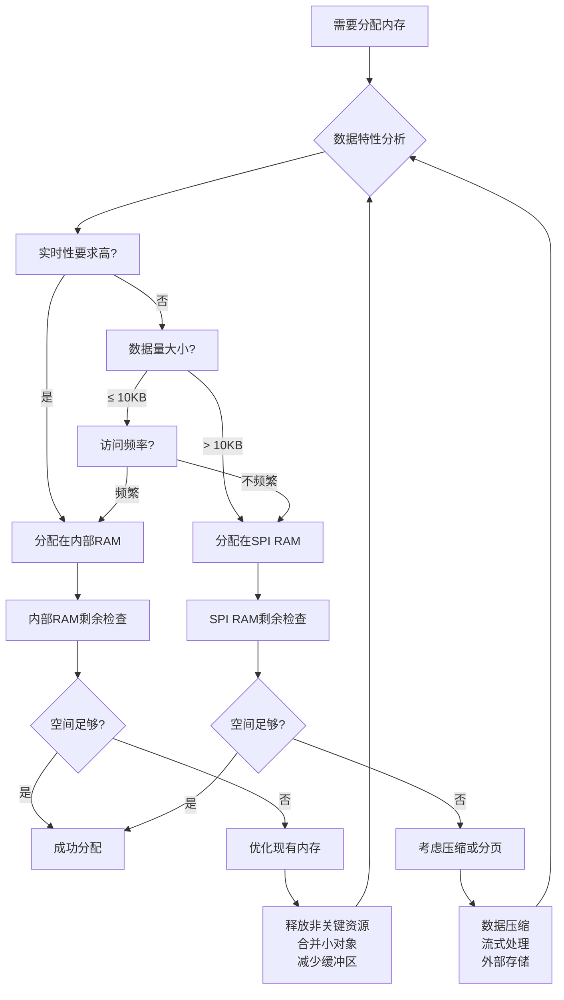

# 嵌入式项目开发经验总结 - 基于小智智能语音设备项目

## 项目概述

小智智能语音设备是基于ESP32-S3平台的嵌入式智能语音助手项目，采用本地唤醒+云端处理的混合架构。项目开发过程中积累了丰富的嵌入式系统开发经验，特别是在资源受限环境下的内存管理、实时性设计和系统稳定性方面。本文档系统性地总结了这些经验，为类似项目提供参考。

## 第一部分：内存分配策略

### 内存分配策略概述

在嵌入式系统中，内存是稀缺且关键的资源。小智项目采用**分层分配、按需规划、动态监控**的策略，确保系统在有限的内存资源下稳定高效运行。

#### 核心策略原则

1. **分层分类策略**：
   - **实时层**：对延迟敏感的数据分配在高速内部RAM
   - **缓冲层**：大容量但非实时数据分配在SPI RAM
   - **存储层**：只读和配置数据存储在Flash

2. **按需规划流程**：
   ```
   需求分析 → 特性评估 → 容量计算 → 位置选择 → 监控优化
   ```

3. **动态监控机制**：
   - 实时监控堆内存使用情况
   - 定期检查任务栈使用率
   - 预警和自动恢复机制

4. **优化平衡原则**：
   - 在实时性和容量间寻求最佳平衡
   - 根据使用频率和访问模式优化布局
   - 避免过度优化导致的复杂性增加

#### 策略实施要点

- **提前规划**：在架构设计阶段明确各模块内存需求
- **量化分析**：基于实际数据计算缓冲区大小，而非经验估计
- **位置优化**：根据数据访问模式选择最合适的内存类型
- **持续监控**：运行时监控内存使用，及时发现和解决问题
- **弹性设计**：为未来扩展预留适当余量

### 1.2 内存类型与特性

#### ESP32-S3内存架构
- **内部RAM**：512KB，速度快，访问延迟低
- **SPI RAM**：8MB外部RAM，速度较慢但容量大
- **Flash**：8MB，用于代码存储和数据分区

#### 内存分配决策矩阵
| 内存类型 | 速度 | 容量 | 适用场景 | 不适用场景 |
|---------|------|------|----------|------------|
| 内部RAM | 高速 | 小 | 任务栈、频繁访问的小对象、ISR | 大缓冲区、不频繁访问数据 |
| SPI RAM | 中速 | 大 | 音频缓冲区、网络缓冲区、UI帧缓冲 | 实时性要求极高的数据 |
| Flash | 低速 | 大 | 代码、只读数据、配置文件 | 频繁写入的数据 |

### 1.3 各模块内存需求分析与分配

#### 音频处理模块
**内存需求特点**：大容量缓冲区、实时性要求高、数据流连续

| 缓冲区 | 大小 | 内存类型 | 计算依据 | 用途 |
|--------|------|----------|----------|------|
| 编码输入 | 20KB | SPI RAM | 2秒音频@16kHz×16bit | 原始PCM音频采集 |
| 编码输出 | 2.5KB | SPI RAM | Opus编码帧(60ms) | 编码后音频上传 |
| 解码输入 | 5KB | SPI RAM | 网络接收缓冲 | 接收云端音频 |
| 解码输出 | 40KB | SPI RAM | 2.5秒音频缓冲 | PCM音频播放缓冲 |

**代码示例**：
```c
// 音频处理器缓冲区分配
audio_processor->enc_input = xRingbufferCreateWithCaps(
    20480,                    // 20KB
    RINGBUF_TYPE_BYTEBUF,     // 变长数据
    MALLOC_CAP_SPIRAM         // 分配在SPI RAM
);
```

#### 网络通信模块
**内存需求特点**：中等缓冲区、连接状态管理、协议栈内存

| 组件 | 大小 | 内存类型 | 配置参数 |
|------|------|----------|----------|
| WiFi RX缓冲区 | 10×1600B | 内部RAM | CONFIG_ESP_WIFI_STATIC_RX_BUFFER_NUM=10 |
| TCP窗口缓冲区 | 6×1460B | 内部RAM | CONFIG_ESP_WIFI_RX_BA_WIN=6 |
| TLS/SSL缓冲区 | 动态 | SPI RAM | CONFIG_MBEDTLS_EXTERNAL_MEM_ALLOC=y |
| WebSocket缓冲区 | 4KB | SPI RAM | 应用层自定义 |

#### 用户界面模块
**内存需求特点**：帧缓冲区大、字体缓存、UI对象内存

| 组件 | 大小 | 内存类型 | 计算依据 |
|------|------|----------|----------|
| 帧缓冲区 | 150KB | SPI RAM | 240×320×16bits |
| 字体缓存 | 20-50KB | SPI RAM | 使用的字体大小和数量 |
| UI对象池 | 10-20KB | 内部RAM | 界面复杂度 |

**SDK配置**：
```bash
CONFIG_LV_USE_CLIB_MALLOC=y      # LVGL使用系统malloc
CONFIG_SPIRAM_ALLOW_BSS_SEG_EXTERNAL_MEMORY=y  # BSS段可放外部RAM
```

#### 任务栈内存
**分配原则**：根据任务复杂度预留足够栈空间，定期监控使用率

| 任务 | 栈大小 | 内存类型 | 优先级 | 监控方法 |
|------|--------|----------|--------|----------|
| 音频播放 | 4KB | SPI RAM | 5 | uxTaskGetStackHighWaterMark |
| 音频编码 | 3KB | SPI RAM | 4 | uxTaskGetStackHighWaterMark |
| 应用主任务 | 4KB | 内部RAM | 3 | uxTaskGetStackHighWaterMark |
| UI渲染 | 4KB | 内部RAM | 2 | uxTaskGetStackHighWaterMark |

**代码示例**：
```c
// 任务创建时指定内存位置
xTaskCreatePinnedToCoreWithCaps(
    audio_processor_play_task,   // 任务函数
    "play_task",                 // 任务名
    4096,                        // 栈大小
    audio_processor,             // 参数
    5,                           // 优先级
    NULL,                        // 任务句柄
    0,                           // 核心ID
    MALLOC_CAP_SPIRAM            // 分配在SPI RAM
);
```

### 1.4 缓冲区大小计算最佳实践

#### 音频缓冲区计算
```c
// PCM音频缓冲区计算
#define SAMPLE_RATE 16000        // 采样率
#define BITS_PER_SAMPLE 16       // 位深度
#define CHANNELS 1               // 声道数
#define BUFFER_DURATION_MS 2000  // 缓冲时长(毫秒)

// 计算公式：采样率 × 时长(秒) × 字节/样本
size_t buffer_size = SAMPLE_RATE * (BUFFER_DURATION_MS / 1000.0) *
                     (BITS_PER_SAMPLE / 8) * CHANNELS;
// 结果：16000 × 2 × 2 × 1 = 64000字节 = 62.5KB
```

#### 网络缓冲区计算
```c
// TCP/IP典型MTU为1460字节，考虑协议开销
#define MAX_PACKET_SIZE 1600     // 包含协议头
#define NUM_BUFFERS 10           // 并发缓冲区数
size_t total_buffer_size = MAX_PACKET_SIZE * NUM_BUFFERS;  // 16KB
```

#### 显示缓冲区计算
```c
// LCD帧缓冲区计算
#define LCD_WIDTH 240
#define LCD_HEIGHT 320
#define BITS_PER_PIXEL 16        // RGB565格式

size_t frame_buffer_size = LCD_WIDTH * LCD_HEIGHT * (BITS_PER_PIXEL / 8);
// 结果：240 × 320 × 2 = 153600字节 = 150KB
```

### 1.5 内存分配位置决策流程



### 1.6 内存监控与调试技术

#### 堆内存监控
```c
// 实时堆内存监控宏
#define PRINT_INTERNAL_HEAP \
    ESP_LOGI(TAG, "[%s:%d] 内部堆: %lu字节", \
             __FILE__, __LINE__, esp_get_free_internal_heap_size())

#define PRINT_SPIRAM_HEAP \
    ESP_LOGI(TAG, "[%s:%d] SPI堆: %lu字节", \
             __FILE__, __LINE__, esp_get_free_spiram_heap_size())

// 在关键点调用
PRINT_INTERNAL_HEAP;
PRINT_SPIRAM_HEAP;
```

#### 任务栈监控
```c
// 定期检查任务栈使用率
void monitor_task_stacks(void) {
    TaskStatus_t *task_status_array;
    UBaseType_t num_tasks = uxTaskGetNumberOfTasks();

    task_status_array = pvPortMalloc(num_tasks * sizeof(TaskStatus_t));

    if (task_status_array != NULL) {
        num_tasks = uxTaskGetSystemState(task_status_array, num_tasks, NULL);

        for (UBaseType_t i = 0; i < num_tasks; i++) {
            UBaseType_t free_stack = uxTaskGetStackHighWaterMark(task_status_array[i].xHandle);
            ESP_LOGI("Stack", "任务 %s: 剩余栈 %u",
                    task_status_array[i].pcTaskName, free_stack);
        }

        vPortFree(task_status_array);
    }
}
```

#### 内存泄漏检测
1. **启动时基线测量**：记录初始内存状态
2. **操作后对比**：执行特定操作后检查内存变化
3. **长期趋势监控**：记录内存使用随时间的变化
4. **组件隔离测试**：单独测试各模块的内存行为

### 1.7 内存优化技巧

#### 缓冲区复用
```c
// 复用缓冲区减少分配次数
static uint8_t shared_buffer[4096];  // 静态分配，避免碎片

void process_data(void *data, size_t size) {
    if (size <= sizeof(shared_buffer)) {
        memcpy(shared_buffer, data, size);
        // 处理数据...
    }
}
```

#### 内存池管理
```c
// 固定大小对象的内存池
#define POOL_SIZE 10
#define OBJECT_SIZE 256

static uint8_t memory_pool[POOL_SIZE][OBJECT_SIZE];
static bool pool_allocated[POOL_SIZE] = {0};

void *pool_alloc(void) {
    for (int i = 0; i < POOL_SIZE; i++) {
        if (!pool_allocated[i]) {
            pool_allocated[i] = true;
            return memory_pool[i];
        }
    }
    return NULL;  // 池已满
}
```

#### 延迟分配
```c
// 按需分配，减少峰值内存使用
static uint8_t *large_buffer = NULL;

void init_large_buffer(void) {
    if (large_buffer == NULL) {
        large_buffer = heap_caps_malloc(LARGE_BUFFER_SIZE, MALLOC_CAP_SPIRAM);
    }
}

void cleanup_large_buffer(void) {
    if (large_buffer != NULL) {
        heap_caps_free(large_buffer);
        large_buffer = NULL;
    }
}
```

## 第二部分：其他开发经验总结

### 2.1 实时性设计

#### 优先级规划策略
| 任务类型 | 优先级范围 | 响应要求 | 示例任务 |
|----------|------------|----------|----------|
| 硬件中断 | 24-31 | 微秒级 | GPIO中断、定时器 |
| 实时处理 | 16-23 | 毫秒级 | 音频采集、VAD检测 |
| 用户交互 | 8-15 | 10-100ms | UI更新、按钮处理 |
| 后台任务 | 1-7 | 秒级 | 日志上传、统计 |

#### 中断处理原则
1. **ISR保持简短**：只做必要操作，通知任务处理
2. **避免阻塞调用**：ISR中不使用malloc、printf等
3. **使用中断屏蔽**：关键操作期间屏蔽不相关中断
4. **中断嵌套控制**：合理设置中断优先级

### 2.2 电源管理

#### 功耗状态设计
```c
typedef enum {
    POWER_STATE_ACTIVE,      // 全功能运行
    POWER_STATE_IDLE,        // 等待唤醒，外设低功耗
    POWER_STATE_SLEEP,       // 深度睡眠，仅RTC运行
    POWER_STATE_OFF          // 完全关闭
} power_state_t;
```

#### 功耗优化措施
1. **时钟频率调节**：按需调整CPU频率
2. **外设电源管理**：不使用时关闭外设电源
3. **WiFi节能模式**：使用WIFI_PS_MIN_MODEM模式
4. **动态背光控制**：根据环境光调节LCD背光
5. **任务调度优化**：合并小任务，减少唤醒次数

### 2.3 模块化架构设计

#### 分层架构
```
应用层 (Application)
├── 业务逻辑
├── 状态管理
└── 用户交互

服务层 (Services)
├── 音频处理服务
├── 网络通信服务
├── 显示服务
└── 存储服务

硬件抽象层 (HAL)
├── 驱动程序
├── 中断处理
└── 电源管理

硬件层 (Hardware)
├── 处理器
├── 外设
└── 传感器
```

#### 接口设计原则
1. **明确职责**：每个模块有单一明确的职责
2. **松耦合**：模块间通过定义良好的接口通信
3. **可测试**：提供测试接口和模拟实现
4. **可替换**：接口抽象允许实现替换

### 2.4 错误处理与恢复

#### 错误分类与处理
| 错误类型 | 处理策略 | 恢复措施 |
|----------|----------|----------|
| 临时错误 | 重试机制 | 自动恢复 |
| 配置错误 | 告警日志 | 使用默认值 |
| 硬件错误 | 安全模式 | 降级运行 |
| 致命错误 | 重启系统 | 工厂重置 |

#### 看门狗设计
```c
// 多级看门狗设计
static esp_timer_handle_t task_watchdog_timer;
static esp_timer_handle_t system_watchdog_timer;

void init_watchdogs(void) {
    // 任务级看门狗：监控关键任务
    esp_timer_create_args_t task_wd_args = {
        .callback = task_watchdog_callback,
        .arg = NULL,
        .dispatch_method = ESP_TIMER_TASK,
        .name = "task_watchdog"
    };
    esp_timer_create(&task_wd_args, &task_watchdog_timer);

    // 系统级看门狗：监控整体系统
    esp_timer_create_args_t sys_wd_args = {
        .callback = system_watchdog_callback,
        .arg = NULL,
        .dispatch_method = ESP_TIMER_TASK,
        .name = "system_watchdog"
    };
    esp_timer_create(&sys_wd_args, &system_watchdog_timer);
}
```

### 2.5 测试与调试

#### 测试策略
1. **单元测试**：各模块独立测试
2. **集成测试**：模块间接口测试
3. **系统测试**：完整功能流程测试
4. **压力测试**：高负载和边界条件测试
5. **耐久测试**：长时间运行稳定性测试

#### 调试工具与技术
1. **日志分级**：ERROR > WARN > INFO > DEBUG > VERBOSE
2. **性能分析**：使用ESP32内置性能计数器
3. **内存分析**：heap_caps_print_info()输出详细信息
4. **任务监控**：FreeRTOS任务状态监控
5. **网络调试**：Wireshark抓包分析

### 2.6 代码质量与维护

#### 编码规范
1. **命名约定**：模块前缀、描述性名称
2. **错误处理**：统一错误码、资源清理
3. **文档注释**：API文档、重要算法说明
4. **版本控制**：语义化版本、变更日志

#### 维护策略
1. **定期重构**：技术债务管理
2. **依赖管理**：明确依赖版本、定期更新
3. **向后兼容**：API版本管理、迁移指南
4. **知识传承**：设计文档、代码评审

## 第三部分：总结与建议

### 3.1 关键成功因素

1. **清晰的内存策略**：提前规划，避免后期优化困难
2. **模块化设计**：提高可维护性和可测试性
3. **完善的错误处理**：提升系统稳定性和用户体验
4. **实时性保证**：满足语音交互的响应要求
5. **功耗优化**：延长电池设备的使用时间

### 3.2 常见陷阱与避免方法

| 常见问题 | 表现 | 避免方法 |
|----------|------|----------|
| 内存碎片 | 分配失败，但总内存充足 | 使用内存池、减少动态分配 |
| 优先级反转 | 高优先级任务被低优先级阻塞 | 使用优先级继承、避免共享资源 |
| 竞态条件 | 随机性错误，难以复现 | 使用互斥锁、原子操作 |
| 资源泄漏 | 内存使用持续增加 | 严格配对分配/释放、使用RAII模式 |
| 中断延迟 | 响应时间不稳定 | 优化ISR、合理设置优先级 |

### 3.3 推荐工具链

1. **开发环境**：VSCode + ESP-IDF插件
2. **调试工具**：OpenOCD + GDB
3. **分析工具**：ESP-IDF Monitor、heap_caps_print_info
4. **测试框架**：Unity测试框架
5. **版本控制**：Git + 语义化提交

### 3.4 未来改进方向

1. **更精细的内存管理**：引入内存分配器统计和预测
2. **动态功耗管理**：基于使用模式的自适应功耗控制
3. **OTA优化**：增量更新、回滚机制
4. **AI边缘计算**：本地轻量级AI模型集成
5. **多设备协同**：设备间通信和协作

---

**文档版本**：1.1
**创建日期**：2026-03-09
**基于项目**：小智智能语音设备 (xiaozhi-250818)
**适用场景**：ESP32系列嵌入式项目，特别是资源受限的智能设备开发

**相关文档**：
- [技术难点与解决方案总结.md](技术难点与解决方案总结.md)
- [项目架构与业务逻辑分析.md](项目架构与业务逻辑分析.md)
- [语音转文本与文本转语音功能用法总结.md](语音转文本与文本转语音功能用法总结.md)

**更新记录**：
- v1.1 (2026-03-09)：添加内存分配策略概述，完善策略描述
- v1.0 (2026-03-09)：初始版本，基于小智项目实践经验总结